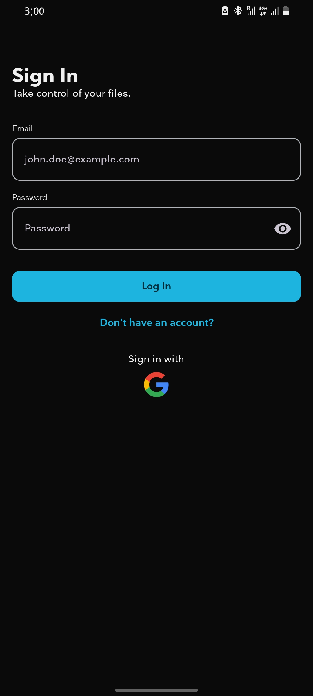
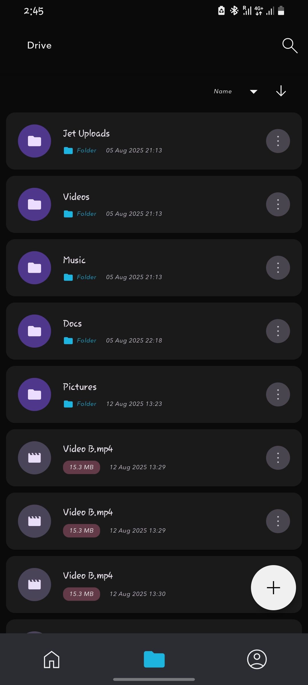
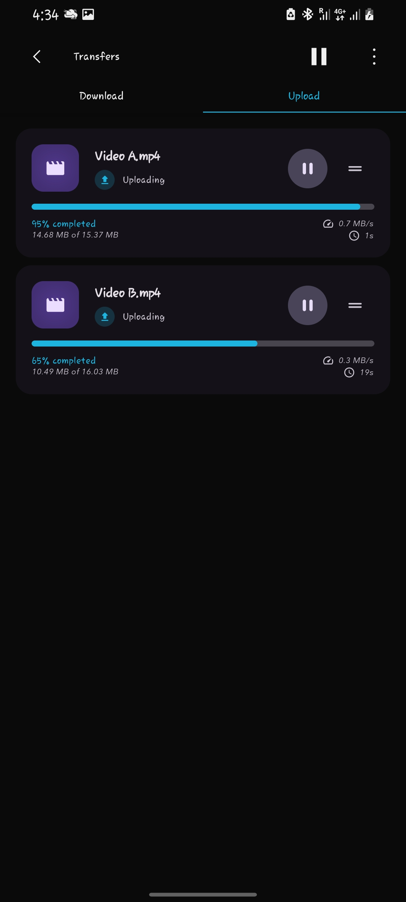
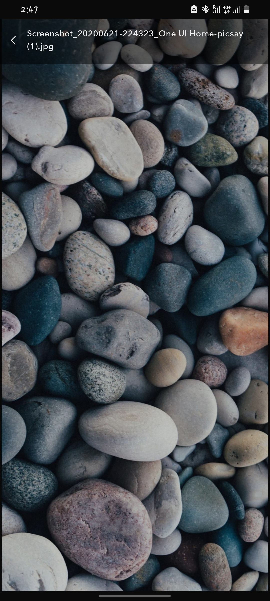
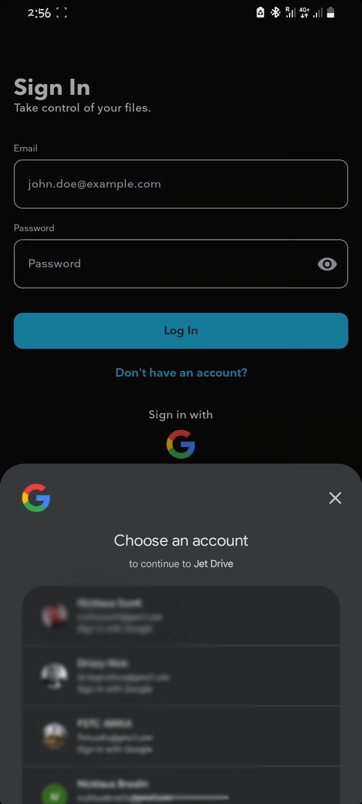

# 📂 JetDrive (Android)

**A secure and modern Android client for cloud file management — with resumable uploads/downloads, offline caching, and real-time sync.**

Built with **Kotlin**, **Jetpack Compose**, and **Koin** for dependency injection, JetDrive-Client is designed for performance, scalability, and offline-first reliability.

---

## 🚀 Features

- **File Browsing & Search** – Navigate directories, preview files, and search quickly.
- **Resumable Transfers** – Pause and resume uploads/downloads without data loss.
- **Offline Caching** – Access previously loaded files without internet.
- **Real-Time Sync** – Automatic file updates powered by background workers.
- **Secure Login** – Google Sign-In with Credential Manager API.
- **Media Playback** – Integrated **Media3 ExoPlayer** for video/audio preview.
- **Drag & Reorder Support** – Enhanced file/folder organization.
- **Adaptive UI** – Material 3 adaptive layouts for multiple screen sizes.

---

## 📸 Screenshots

| Login Screen | File Browser | Transfer Queue | Image Preview |
|--------------|--------------|----------------|---------------|
|  |  |  |  |

---

## 🎥 Video Demo

[](https://raw.githubusercontent.com/nicklauscott/JetDrive-Client/main/assets/Demo.mp4)

---

## 🏗 Architecture

| Layer            | Technology / Approach                                          |
|------------------|----------------------------------------------------------------|
| **Language**     | Kotlin                                                         |
| **UI Framework** | Jetpack Compose + Material 3 Adaptive                          |
| **DI**           | [Koin](https://insert-koin.io/)                                |
| **Networking**   | [Ktor Client](https://ktor.io/) (Core, CIO, Android, Auth, JSON, Logging) |
| **Serialization**| Kotlinx Serialization JSON                                     |
| **Caching**      | Room Database + DataStore Preferences                          |
| **State Mgmt**   | Jetpack ViewModel + Coroutines/StateFlow                       |
| **Background Work** | WorkManager (via Koin integration)                          |
| **Navigation**   | Jetpack Navigation Compose & Navigation 3                      |
| **Auth**         | Google Identity API + AndroidX Credentials                     |
| **Media**        | Media3 ExoPlayer + UI Compose                                  |
| **Image Loading**| Coil & Coil-Compose                                            |

---

## ⚙️ Prerequisites

- **Android Studio**: Giraffe+ (latest recommended)
- **JDK**: 17+
- **Android SDK**: API level 30+
- **Backend**: JetDrive Spring Boot API (or compatible cloud file backend)
- **Configuration**: `local.properties` with backend URL and keys

---

## 🔧 Getting Started

1. **Clone the repository**
   ```bash
   git clone https://github.com/nicklauscott/JetDrive-Client.git
   cd JetDrive-Client
